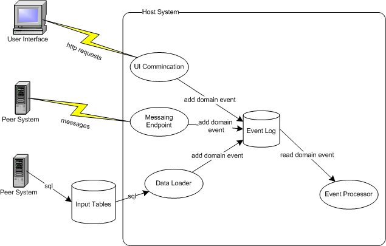
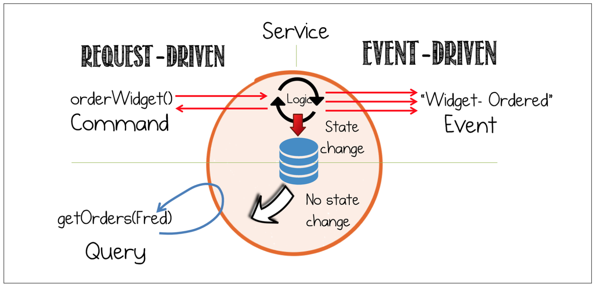

# What is Event

## How we define Event?

* [Domain Event](https://www.martinfowler.com/eaaDev/DomainEvent.html): Captures the memory of something interesting which affects the domain.

* [Streaming services event](https://www.oreilly.com/programming/free/designing-event-driven-systems.csp):  event both a fact and notification. 
  * [Event Notification](https://martinfowler.com/articles/201701-event-driven.html) means just notify the recipient and all the actions depends on the subscriber. And it is a good pattern and quite useful, but we need to pay attention to the trap. If an event used as passive-aggressive command, that means the source system expect recipient to carry out an action, that's the expectation  for command, not event.
  * Event fact with state means there is some thing updated and trigger this event with changes, so the subscriber could update by themselves without remote call.

